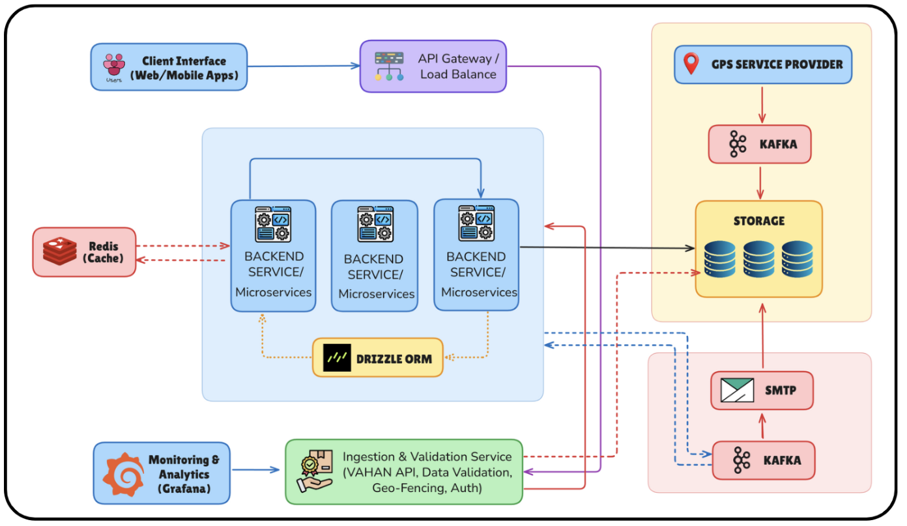

## 🚩 PS: Swadeshi for Atmanirbhar Bharat - Transportation & Logistics (25138)

Submit your ideas to address the growing pressures on the city's resources, transport networks, and logistic infrastructure.

---

## 💡 Solution: MARG Unified GPS Platform


MARG is a unified GPS platform transforming government logistics with real-time tracking, predictive analytics, and seamless data integration, enabling smarter, more transparent operations. It offers multiple features like:

- **Smart Geofence Engine**
- **Historical Trail Playback**
- **Role-Based Access Control**
- **Bulk & Smart Utilities**
- **Smart Alerts**
- **Advanced Dashboards**
- **Comprehensive Reports & Export**
- **Email Notifications & Alerts**


## 🏗️ Architecture

The following diagram illustrates the high-level architecture of the MARG platform, showing the interaction between frontend, backend, data processing, and storage components:



---

## 📌 Project Overview

### 🖥️ Frontend
- Built with **React + TailwindCSS** for a clean, responsive, and modern UI.  
- **Role-based access control** with page/group-specific permissions for departments, vendors, and admins.  
- Features **real-time dashboards**, **trip & vehicle analytics**, **geofenced overlays**, and **exportable reports**.  
- Includes **light/dark mode**, **lazy loading**, and **code-splitting** for optimized performance.  

### ⚙️ Backend
- Powered by **Node.js + Express** for scalable RESTful API development.  
- Handles **50,000+ GPS & shipment events/day** via **RESTful APIs** and **TMS triggers** ensuring end-to-end trip coverage.  
- **Kafka-based event pipeline** processes **1M+ location updates/day** with **99.99% uptime** and low latency.  
- Database: **MySQL** with **Drizzle ORM indexing**, improving query performance by **70%** for real-time operations.  
- Implements **geofencing, smart alerts (speeding, route deviation, GPS loss)** and **historical trip replay**.  
- Secure **authentication**, **vendor/customer grouping**, and **bulk operations APIs** for large-scale fleet management.

---

## 🛠️ Key Features
- **Real-time trip & vehicle analytics** – ETAs, stoppages, speed, and drive time.  
- **Fullscreen satellite & geofenced overlays** for dynamic live tracking.  
- **7 Smart Alerts** – Speeding, GPS Loss, Route Deviation, etc., with **automatic email notifications**.  
- **Historical path plotting** with speed, address, and timestamp.  
- **Role-based access control** and **page/group-specific permissions**.  
- **Bulk Excel upload/edit/delete** and **multi-select actions**.  
- **5 report types with filter-based Excel exports** across all analytics views.  
- **Light/Dark mode toggle** for better accessibility.  


## 🛠 Setup Instructions

### Backend

1. **Install Dependencies**
   ```bash
   cd backend
   npm install
   ```
2. **Create a `.env` file** in the `backend` directory and add:
   ```env
        # ──────────────── Server Configuration ────────────────
        PORT=3000
        API_URL=
        JWT_SECRET=

        # ──────────────── Database Configuration ──────────────
        DATABASE_URL=
        DB_HOST=
        DB_PORT=
        DB_USER=
        DB_PASSWORD=
        DB_NAME=

        # ──────────────── Kafka Configuration ─────────────────
        KAFKA_BROKERS=localhost:9092
        KAFKA_TOPIC=api-data-topic

        # ──────────────── Third-Party APIs ────────────────────
        # LocationIQ
        REVERSE_PROXY_URL=
        # OLA API
        OLA_API_KEY=

        # ──────────────── Email Configuration ─────────────────
        EMAIL_HOST=
        EMAIL_PORT=465
        EMAIL_SECURE=true
        EMAIL_USER=
        EMAIL_PASSWORD=
        EMAIL_FROM=

        # ──────────────── Alert Processing ────────────────────
        ENABLE_ALERT_PROCESSING=true
        # Interval in milliseconds (e.g. 20 minutes)
        ALERT_PROCESSING_INTERVAL=1200000
        ALERT_BATCH_SIZE=100

   ```
   Replace with your actual values.

### Frontend

1. **Install Dependencies**
   ```bash
   cd ../Frontend
   npm install
   ```
2. **Configure Environment Variables**
   - Copy `.env.example` to `.env`:
     ```bash
     cp .env.example .env
     ```
   - Edit `.env` and set:
     ```env
     VITE_BACKEND_URL=your-backend-url-here
     ```

---

## 🚀 Running the Project

### Backend
Start the backend development server:
```bash
cd backend
npm run dev
```

### Frontend
Start the frontend development server:
```bash
cd Frontend
npm run dev
```
The app will be available at [http://localhost:5173](http://localhost:5173) (or as configured by Vite).

---

## 🔄 Database Schema Changes (Backend)
If you make changes to the backend database schema:
1. **Generate Migrations**:
   ```bash
   npx drizzle-kit generate
   ```
2. **Apply Migrations**:
   ```bash
   npx drizzle-kit migrate
   ```

---

## 🗂 Project Structure
- `backend/`: Node.js/TypeScript backend API
- `Frontend/`: React/TypeScript frontend app

---

## 🎨 Tech Stack

### Frontend
- **React.js + Vite** (UI framework and bundler)
- **Tailwind CSS + shadcn/ui** (styling & components)
- **Axios** (API communication)
- **Recharts** (visual analytics & reports)

### Backend
- **Node.js / Express.js** (RESTful API server)
- **Kafka** (event streaming & ingestion pipeline for GPS/shipment data)
- **Redis** (caching & fast state management)
- **Drizzle ORM + MySQL** (database layer with optimized indexing)

### Data & Integration
- **RESTful APIs** (ingestion of 50,000+ GPS & shipment events/day from vendor feeds and TMS)
- **Kafka Consumer/Producer** (processing 1M+ location updates/day with low latency)
- **Geofencing & Alerts Engine** (event-driven anomaly detection like speeding, GPS loss, route deviation)

### Infrastructure & Deployment
- **Docker** (containerized deployment)
- **Vercel / Nginx** (frontend hosting & reverse proxy)
- **CI/CD pipelines** (automated deployments)

---


## Team Details

**Team Name:** Tree.io

**Team Leader:** [@Dhruv](https://github.com/Dhruv-Tuteja)

**Team Members:**

- **MEMBER_1** - 2023UIN3332 - [@Dhruv](https://github.com/Dhruv-Tuteja)
- **MEMBER_2** - 2023UCS1548 - [@Nayan](https://github.com/NASA12345)
- **MEMBER_3** - 2023UCA1804 - [@Tushar](https://github.com/TusharSachdeva29)
- **MEMBER_4** - 2023UCA1869 - [@Jai](https://github.com/JaiBansal007)
- **MEMBER_5** - 2023UCA1728 - [@Yashaswini](https://github.com/Yashaswini-Sharma)
- **MEMBER_6** - 2023UCA1600 - [@Rohan](https://github.com/RohanJ26)

## Project Links

- **SIH Presentation:** [Final SIH Presentation](code/docs/Tree.io-SIH.pptx.pdf)
- **Video Demonstration:** [Watch Video](UNLISTED YOUTUBE LINK)
- **Live Deployment:** [View Deployment](DEPLOYED LINK IF ANY)
- **Source Code:** [GitHub Repository](https://github.com/TusharSachdeva29/sih-25)
- **Additional Resources:** 
    - **Real-Time Fleet Tracking Systems:** [ResearchGate: Fleet Management with GPS](https://www.researchgate.net/publication/332938511_Confrontation_between_Puyeo_and_Moyongoe_in_the_280s_and_the_East-Puyeo_Problem)
    - **Event Streaming with Apache Kafka:** [Confluent: Kafka in Transportation](https://www.confluent.io/blog/)
    - **Predictive ETA and Route Optimization:** [IEEE: ETA Prediction Models](https://ieeexplore.ieee.org/document/9378320)
    - **Geofencing & Location Analytics:** [Esri — Geofencing & Real-time Tracking](https://www.esri.com/en-us/arcgis/products/arcgis-geoevent-server/overview)
    - **Digital Infrastructure for Smart Governance:** [UN E-Government Survey](https://publicadministration.un.org/egovkb/en-us/Reports/UN-E-Government-Survey-2022)
